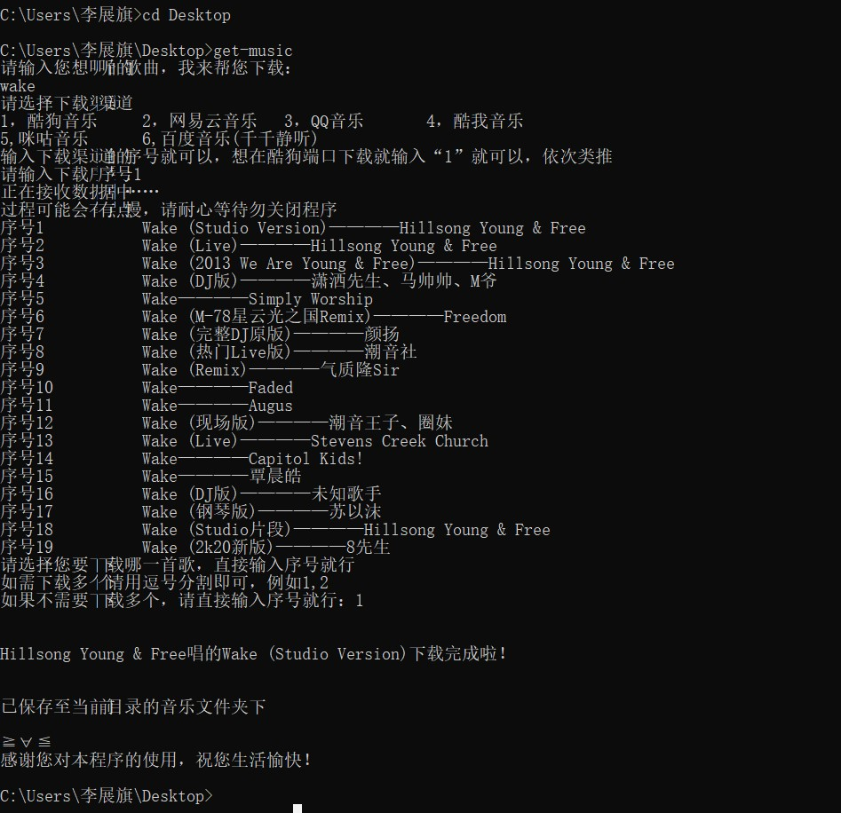

# get-music-lizhanqi ：Listen to what you want
多合一音乐下载，搜索，python，支持酷狗，网易，百度，酷我，咪咕和qq音乐平台的音乐下载，有些支持下载封面和歌词有些则不支持，requests和json占主要

<p align='center'>
  <a></a>
</p>
<p align="center">
  <a></a>
  <a></a>
</p>

**[get-music-lizhanqi](https://github.com/lzq-hopego/get-music-lizhanqi)** is a command line tool which helps you search and download music from multiple sources.

Support for QQ music, Netease music, guwo music, Kugou music and Baidu music. See [supported sources](#支持的音乐源列表).

**Python3 Only. Python 3.5+ Recommended.**


**[get-music-lizhanqi](https://github.com/lzq-hopego/get-music-lizhanqi)
**是一个基于Python3的命令行工具，可以从多个网站搜索和下载音乐，方便寻找音乐，解决不知道哪个网站有版权的问题。工具的本意是**聚合搜索**，API
是从公开的网络中获得，**不是破解版**，也听不了付费歌曲。

**禁止将本工具用于商业用途**，如产生法律纠纷与本人无关，如有侵权，请联系我删除。


QQ邮箱：3101978435@qq.com

最近API封杀有点多，个人有点维护不过来,所以更新不及时不要怪我哦。

> 注意: 部分音乐源在一些国家和地区不可用。

## 功能

- 部分歌曲支持无损音乐
- 优先搜索高品质音乐（无损 -> 320K -> 128K）
-支持一次下载多个版本的歌曲
- 支持下载歌词和封面（部分）

> 注意：仅支持Python3，建议使用 **Python3.5 以上版本**

## 安装

使用pip安装（推荐，注意前面有一个`py`）：

```bash
$ pip3 install get-music-lizhanqi
```

手动安装（最新）：

```bash
$ git clone https://github.com/lzq-hopego/get-music-lizhanqi.git
$ cd get-music-lizhanqi
$ python3 setup.py install
```


在以下环境测试通过：

| 系统名称 | 系统版本       | Python版本 |
| -------- | -------------- | ---------- |
| macOS    | 10.14          | 3.7.0      |
| macOS    | 10.13          | 3.7.0      |
| Windows  | Windows 7 x64  | 3.5.0      |
| Windows  | Windows 10 x64 | 3.5.0      |
| Ubuntu   | 16.04 x64      | 3.5.0      |

## 使用方式

直接在命令行敲:

```
$ get-music
～请输入您想听的歌曲，我来帮您下载：
```
输入歌曲名“wake”
```
$wake
```
```
～请选择下载渠道
1，酷狗音乐     2，网易云音乐   3，QQ音乐       4，酷我音乐
5,咪咕音乐      6,百度音乐(千千静听)
输入下载渠道的序号就可以，想在酷狗端口下载就输入“1”就可以，依次类推
请输入下载序号:
```
输入下载渠道的序号，这里选择的是酷狗，也就是渠道1
```
$请输入下载序号:1
```
这是就会开始抓取歌曲的信息并返回(在这里我仅展示5条，实际有几条要根据返回的数据来定)，到了这里脚本就会提醒你要下载哪一个
```
～
序号1           Wake (Studio Version)————Hillsong Young & Free
序号2           Wake (Live)————Hillsong Young & Free
序号3           Wake (2013 We Are Young & Free)————Hillsong Young & Free
序号4           Wake (DJ版)————潇洒先生、马帅帅、M爷
序号5           Wake————Simply Worship
··········
请选择您要下载哪一首歌，直接输入序号就行
如需下载多个请用逗号分割即可，例如1,2
如果不需要下载多个，请直接输入序号就行:
```
这里我们选择下载第一个也就是序号为1的“Hillsong Young & Free”唱的“Wake (Studio Version)”
```
$如果不需要下载多个，请直接输入序号就行:1
```
然后等几秒（具体要看你的网速，不支持断点续传）就会出现以下提示：
```
～
Hillsong Young & Free唱的Wake (Studio Version)下载完成啦！


已保存至当前目录的音乐文件夹下

≧∀≦
感谢您对本程序的使用，祝您生活愉快！
```
这时这首歌已经成功的被你get到你的电脑中啦，具体要看你执行名的路径，如果是：
```
C:\Users\xxx\Desktop>
```
那么这首歌保存的位置就是"C:\Users\xxx\Desktop\音乐"
因为上面的这个命令实在桌面执行的所以程序会在桌面创建一个“音乐”文件夹，并将下载到的音乐文件放在该文件夹中
如果在其他目录下执行也一样会创建“音乐”文件夹，所以在当前目录
```
$cd 音乐
$dir
```
就能看到这个脚本给您下载的音乐文件啦

- 六个搜索引擎任你挑`qq netease kugou baidu kuwo migu`，每个数量限制为5，保存目录为当前目录的音乐文件夹。
- 指定序号时可以使用`1 1,2(中间的逗号要用英文逗号哦，并且有的不支持，不支持这样会有提示)`的形式。
- 默认对搜索结果排序和去重，排序顺序按照歌手和歌名排序，当两者都相同时保留最大的文件。
- 无损音乐歌曲数量较少，如果没有无损会默认下载320K或128K。
-下载的歌曲的质量以最终保存的文件为准


## 示例：

<a></a>

## 支持的音乐源列表

| 音乐源     | 缩写    | 网址                      | 有效 | 无损 | 320K | 封面 | 歌词 | 歌单 | 单曲 |
| ---------- | ------- | ------------------------- | ---- | ---- | ---- | ---- | ---- | ---- | ---- |
| QQ音乐     | qq      | <https://y.qq.com/>       | ✓     | -    | -    | ✕    |  -    | ✕    | ✕    |
| 酷狗音乐   | kugou   | <http://www.kugou.com/>   | ✓     | -    | -    | -    | ✕    | -    | ✕    |
| 网易云音乐 | netease | <https://music.163.com/>  | ✓    | -    | ✓    | -   | -   |  -   |  -    |
| 咪咕音乐   | migu    | <http://www.migu.cn/>     | ✓    | -   |  -   |  -    |  -   | ✕    | ✕    |
| 百度音乐   | baidu   | <http://music.baidu.com/> | ✓    | -    | ✓    | ✓    | ✓    | ✕    | ✕    |
| 酷我音乐   | kuwo   | <http://www.kuwo.cn//> | ✓    | -    |  -  |  -   |  -   | ✕    | ✕    |

> `-`表示不一定支持，`✓`表示部分或完全支持，`✕`表示尚未支持

欢迎提交支持更多音乐源！


## 更新记录

- 2022-04-12 完成v0.0.20版，支持百度音乐(千千静听),支持-help（查看帮助），-v（查看当前版本）
- 2022-04-11 完成v0.0.11版，支持咪咕音乐
- 2022-04-10 完成v0.0.9版，更新算法，使时间复杂度更低,并支持酷我音乐
- 2022-04-09 完成v0.0.5版，支持QQ音乐
- 2022-04-09 完成v0.0.1版，支持酷狗和网易云

## 提Issues说明

- **检查是否是最新的代码，检查是否是Python3.5+，检查依赖有没有安装完整**。
- 说明使用的操作系统，例如Windows 10 x64
- 说明Python版本，以及是否使用了pyenv等虚拟环境
- 说明使用的命令参数、搜索关键字和出错的音乐源
- 如果有新的思路和建议也欢迎提交


## Credits 致谢

本项目受以下项目启发，参考了其中一部分思路，向这些开发者表示感谢。

- <https://github.com/requests/requests>

## THE END
- 本脚本仅支持学习使用，如有发现有任何商业用途，一经发现您将受到法律责任。
- 本程序使用的接口全部来源于网络，切不可有任何商业用途，或我程序中有涉及你公司利益的，你可以联系我，我会及时删除源代码，并不再更新。
- 作者兼维护者邮箱（李先生）：3101978435@qq.com

## 用爱发电

维护不易，欢迎扫描投币二维码


## LICENSE

[MIT License](https://github.com/0xHJK/music-dl/blob/master/LICENSE)
